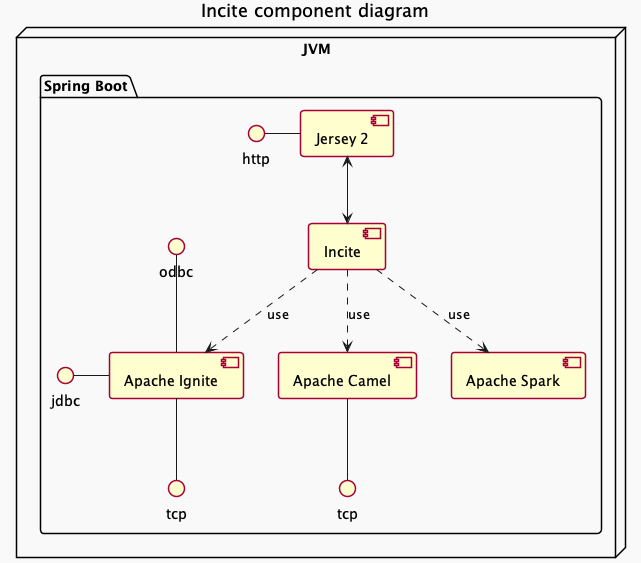
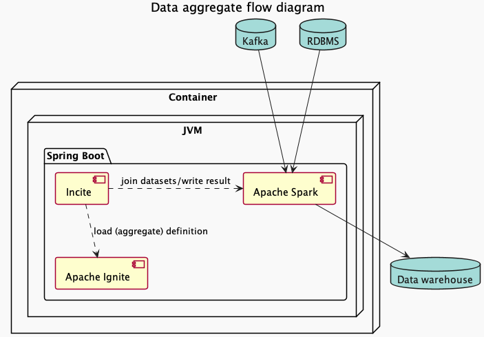
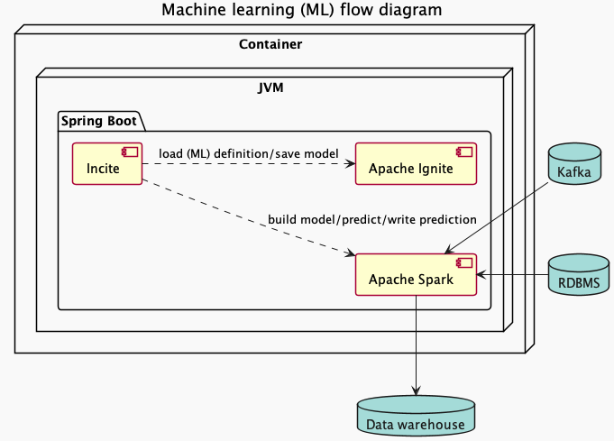

# Incite

## What is Incite?
Incite is a wrapper of popular data related frameworks/tools in the Java ecosystem. It aims to become an easy-to-use 
data hub by providing easier access of popular technologies to non-developers (i.e. Business analysis) in an 
organization. As of now, Incite is in proof of concept stage and is not recommended for production use.

### What can Incite do?
* Data [streaming] aggregation & [streaming] transformation
* Enterprise integration/message bus
* Hybrid transaction/analytical processing (HTAP) SQL database
* Machine Learning

### What frameworks/libraries are being utilised by Incite?
As of now, the following frameworks are utilised by Incite,

* Apache Camel 3.11.6 (Enterprise integration)
* Apache Ignite 2.13.0 (Compute grid/In memory database/Message grid)
* Apache Spark 3.2.1 (Data analytic & machine learning)



## Data [streaming] aggregation & [streaming] transformation
Data aggregation is to compile and combine data from different data-sources for different kind of data-processing. 
Incite provides RESTful APIs which allow users to define and run data aggregation against multiple origins (sources) 
and write the result of the aggregation to different destinations (sinks). Not only that, Incite supports streaming 
aggregation as it supports streaming read and streaming write from/to different data-sources.

Data transformation is the process of converting data from one format or structure into another format or structure. As
of April 16, 2022, Incite can apply simple transformation via SQL like function to data loaded from each of the data 
sources. 



### Supported [data] sources & [data] sinks
#### Sources
* JDBC (includes Embedded Ignite & Ignite) <Non-streaming>
* Kafka <Non-Streaming & Streaming>

#### Sinks
* Embedded Ignite <Non-streaming>
* JDBC (excludes Embedded Ignite & Ignite) <Non-streaming>
* Kafka <Non-streaming & Streaming>

### RESTful API

[Read more](./incite-rs/README.md)

## Enterprise integration
Enterprise integration allow data/message generated by different system to be integrated and processed to be further 
processed or to be shared. This functionality of Incite is powered by Apache Camel. Incite provides RESTful APIs which 
allow users to define an integration route written in Apache Camel's YAML DSL to ingest data from other systems and to 
egress the processed data to other systems or databases. 

### RESTful API

[Read more](./incite-rs/README.md)

## HTAP SQL database
Incite is built with Apache Ignite 2.x, a hybrid transaction/analytical processing (HTAP) SQL database, in mind. This 
means that Incite is friendly to both analytical & transactional workload. One does not have to transfer data stored by 
transactional operations to a standalone data warehouse to be analysed which may significantly save resources and time.

There are two SQL engines offered by Apache Ignite since 2.13.0. They are Calcite (currently in beta) & H2. H2 is the
default SQL engine at this moment.

```properties
# Example SpringBoot configuration (Calcite)
spring.datasource.driver-class-name=org.apache.ignite.IgniteJdbcThinDriver
spring.datasource.url=jdbc:ignite:thin://${incite.host}:${incite.port}/incite?lazy=true&queryEngine=calcite
spring.datasource.username=${incite.username}
spring.datasource.password=${incite.password}
```

```properties
# Example SpringBoot configuration (H2)
spring.datasource.driver-class-name=org.apache.ignite.IgniteJdbcThinDriver
spring.datasource.url=jdbc:ignite:thin://${incite.host}:${incite.port}/incite?lazy=true&queryEngine=h2
spring.datasource.username=${incite.username}
spring.datasource.password=${incite.password}
```

Alternatively, user can use query hint to use the desired SQL engine on the fly.
```roomsql
-- Calcite
SELECT /*+ QUERY_ENGINE('calcite') */ * FROM table;
-- H2
SELECT /*+ QUERY_ENGINE('h2') */ * FROM table;
```

## Machine Learning (ML)
Machine learning (ML) is a set of algorithms which provides insight of data. They can improve itself through the use of 
data. Incite provides RESTful API to define an ML job. Saved ML job can be triggered by RESTful API. Furthermore,
Incite also provide SQL functions to run machine learning algorithms against data stored on incite by using SQL query.
Currently, Incite only supports the following ML algorithms.

:warning: As of now, Incite is not able to build model from streaming sources due to a limitation in Apache Spark.



#### Classification
###### Supported algorithm:
* Logistic Regression

#### Clustering
###### Supported algorithm:
* Bisecting k-means
* K-means

#### Recommendation
###### Supported algorithm:
* Alternating Least Squares (ALS)

For Alternating Least Squares (ALS), user may change the following configuration,
* userColumn [Int/Long] (Default: user)
* itemColumn [Int/Long] (Default: item)
* ratingColumn [Double/Float] (Default: rating)

### RESTful API

As mentioned, Incite provides a set of API for ML related operations. These APIs allow one to define an ML task on 
which data sources to build model from and the data sinks to write the predictions to, to create a new model from the 
latest data in the data sources, to perform prediction with the given JSON input/SQL query (, which will be used to 
retrieve the data from Incite for prediction).

[Read more](./incite-rs/README.md)

### SQL functions

#### Classification
```roomsql
-- Set up a classification entity with embedded ignite as both data source & data sink.
select set_up_classification('LogisticRegression', '{"featureColumns": ["age", "sex"], "labelColumn": "result", "maxIterations": 10}', 'select * from guests', 'classified_guests', 'id');
-- Return the ID of the entity

-- Train a model for a saved Classification entity
select build_classification_model('58b1a40f-571d-4b85-8b31-65cee8d9f9a2');
-- Return the ID of the built model

-- Perform prediction for the given Classification entity with the given sql query and write the result to the sinks
-- defined in the Classification entity.
select classification_predict('58b1a40f-571d-4b85-8b31-65cee8d9f9a2', 'select * from sample_dataset');
-- Return the result in JSON format
```

#### Clustering
```roomsql
-- Set up a Clustering entity with embedded ignite as both data source & data sink.
select set_up_clustering('KMeans', '{"featureColumns": ["age", "sex", "numbersOfKids"], "maxIterations": 1, "seed": 1}', 'select * from guests', 'guest_clusters', 'id');
-- Return the ID of the entity

-- Train a model for a saved Clustering entity
select train_clustering_model('2036cd45-557e-41ce-a157-e64253295032');
-- Return the UUID of the built model

-- Perform prediction for the given Clustering entity and given sql query
select clustering_predict('2036cd45-557e-41ce-a157-e64253295032', 'select * from sample_dataset');
-- Return the result in JSON format
```

#### Recommendation
```roomsql
-- Set up a Recommendation entity with embedded ignite as both data source & data sink.
select set_up_recommendation('Alternating Least Squares', '{"itemColumn": "item", "maxIterations": 10, "userColumn": "user"}', 'select r."user", r.item, r.rating from rating r', 'recommendation_result', 'id');
-- Return the ID of the entity

-- Build a model for a Recommendation entity stored to Incite
select train_recommendation_model('791ed421-4ba6-4fcb-8d09-22fda3d99696');
-- Return the ID of the built model

-- Perform prediction for the given Recommendation entity and given sql query
select recommendation_predict('791ed421-4ba6-4fcb-8d09-22fda3d99696', 'select * from sample_dataset');
-- Return the result in JSON format
```

## Usage

:warning: As of now, Incite is a proof of concept and is not being community reviewed. Please use Incite at your own risk.

[Read more](./incite-distro/README.md)

## Roadmap

* Apache Spark 3.2.x :white_check_mark:
* Calcite based SQL engine (w/ Apache Ignite 2.13.x) :white_check_mark:
* Completion of documentation
* Completion of unit tests
* Data [streaming] transformation on top of [streaming] aggregate :white_check_mark:
* Dockerfile
* Docker compose file
* FileSource & FileSink :white_check_mark:
* Java 11 Support
  * Replace org.apache.ignite:ignite-spark and related logic with custom logic due to Java 8 lock-in
* More Machine Learning algorithms
  * Regression
* RedisStreamSource
* SQL function to start data [streaming] aggregate


## Acknowledgment

Incite is built around Apache Camel, Apache Ignite and Apache Spark. Incite thanks the community of Apache Camel, 
Apache Ignite and Apache Spark for their contribution (respectively) to the mentioned projects.

## Legal Disclaimer :warning:

Incite IS PROVIDED BY THE COPYRIGHT HOLDERS AND CONTRIBUTORS “AS IS”, WITHOUT WARRANTY OF ANY KIND, EXPRESS OR
IMPLIED, INCLUDING BUT NOT LIMITED TO THE WARRANTIES OF MERCHANTABILITY, FITNESS FOR A PARTICULAR PURPOSE AND 
NON-INFRINGEMENT.

IN NO EVENT SHALL THE COPYRIGHT OWNER OR CONTRIBUTORS BE LIABLE FOR ANY DIRECT, INDIRECT, INCIDENTAL, SPECIAL, 
EXEMPLARY, OR CONSEQUENTIAL DAMAGES (INCLUDING, BUT NOT LIMITED TO, PROCUREMENT OF SUBSTITUTE GOODS OR SERVICES; LOSS OF
USE, DATA, OR PROFITS; OR BUSINESS INTERRUPTION) HOWEVER CAUSED AND ON ANY THEORY OF LIABILITY, WHETHER IN CONTRACT, 
STRICT LIABILITY, OR TORT (INCLUDING NEGLIGENCE OR OTHERWISE) ARISING IN ANY WAY OUT OF THE USE OF THIS SOFTWARE, EVEN 
IF ADVISED OF THE POSSIBILITY OF SUCH DAMAGE.

## License

All materials of Incite are copyright © Incite contributors, released under Apache License 2.0.

[Read more](./LICENSE)