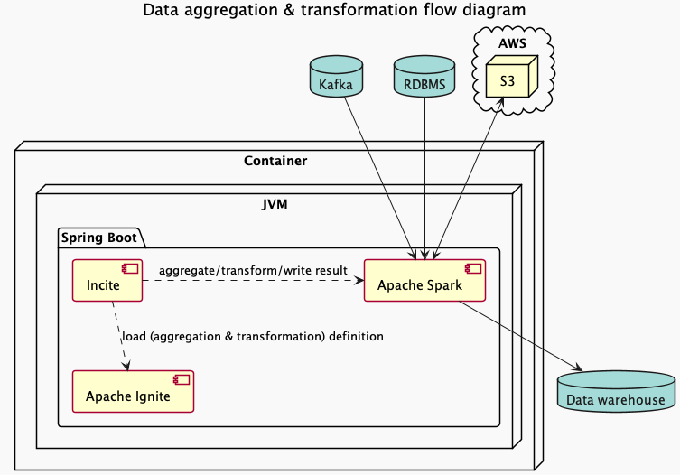
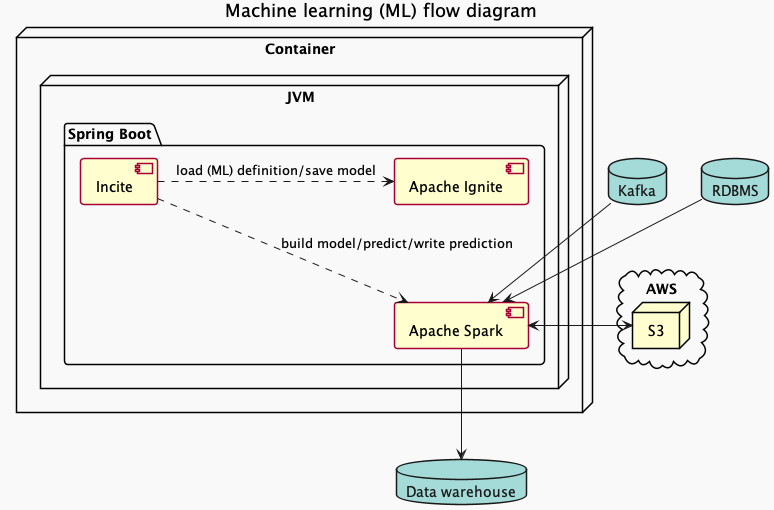

# Incite

## What is Incite?
Incite is a wrapper of popular Java data related frameworks. It aims to provide easier access of these technologies for 
non-developers (i.e. Business analysis) in one organization.

As of now, the following frameworks are embedded into Incite,
* Apache Camel (A well known enterprise integration framework)
* Apache Incite (A well known in memory database which can also serve as a compute/message grid)
* Apache Spark (A well known framework for data analytic & machine learning)


Currently, it provides the following features,

* Data [streaming] aggregation
* Enterprise integration 
* Hybrid transaction/analytical processing (HTAP) SQL database
* Machine Learning

## Data [streaming] aggregation
Data aggregation is to compile and combine data from different data-sources for different kind of data-processing. 
Incite provides RESTful APIs which allow users to define and run data aggregation against multiple origins (sources) 
and write the result of the aggregation to different destinations (sinks). Not only that, Incite supports streaming 
aggregation as it supports streaming read and streaming write from/to different data-sources.



#### Supported sources
* JDBC (includes Embedded Ignite & Ignite) <Non-streaming>
* Kafka <Non-Streaming & Streaming>

#### Supported sinks
* Embedded Ignite <Non-streaming>
* JDBC (excludes Embedded Ignite & Ignite) <Non-streaming>
* Kafka <Non-streaming & Streaming>

### RESTful API

[Read more](./incite-rs/README.md)

## Enterprise integration
Enterprise integration allow data/message generated by different system to be integrated and processed to be further 
processed or to be shared. This functionality of Incite is powered by Apache Camel. Incite provides RESTful APIs which 
allow users to define an integration route written in Apache Camel's YAML DSL to ingest data from other systems and to 
egress the processed data to other systems or databases. 

### RESTful API

[Read more](./incite-rs/README.md)

## HTAP SQL database
Incite is powered by Apache Ignite which is also a hybrid transaction/analytical processing (HTAP) SQL database. 
This means that Incite is friendly to both analytical & transactional workload. One does not have to transfer data 
stored by transactional operations to a standalone data warehouse to be analysed which saves resources and time.

```properties
## Example SpringBoot configuration
spring.datasource.driver-class-name=org.apache.ignite.IgniteJdbcThinDriver
spring.datasource.url=jdbc:ignite:thin://${incite.host}:${incite.port}/incite?lazy=true
spring.datasource.username=${incite.username}
spring.datasource.password=${incite.password}
```

## Machine Learning (ML)
Machine learning (ML) is a set of algorithms which provides insight of data. They can improve itself through the use of 
data. Incite provides RESTful API to define an ML job. Saved ML job can be triggered by RESTful API. Furthermore,
Incite also provide SQL functions to run machine learning algorithms against data stored on incite by using SQL query.
Currently, Incite only supports the following ML algorithms.

:warning: As of now, Incite is not able to build model from streaming sources due to a limitation in Apache Spark.



#### Classification
###### Supported algorithm:
* Logistic Regression

#### Clustering
###### Supported algorithm:
* Bisecting k-means
* K-means

#### Recommendation
###### Supported algorithm:
* Alternating Least Squares (ALS)

### RESTful API

As mentioned, Incite provides a set of API for ML related operations. These APIs allow one to define an ML task on 
which data sources to build model from and the data sinks to write the predictions to, to create a new model from the 
latest data in the data sources, to perform prediction with the given JSON input/SQL query (, which will be used to 
retrieve the data from Incite for prediction).

[Read more](./incite-rs/README.md)

### SQL functions

#### Classification
```roomsql
-- Build a model for a Classification entity stored to Incite
select build_classification_model('58b1a40f-571d-4b85-8b31-65cee8d9f9a2');
-- Return the UUID of the built model

-- Perform prediction for the given Classification entity with the given sql query and write the result to the sinks
-- defined in the Classification entity.
select classification_predict('58b1a40f-571d-4b85-8b31-65cee8d9f9a2', 'select * from sample_dataset');
-- Return the result in JSON format

-- Build an ad-hoc logistic regression model (without creating a Classification entity)
select build_logistic_regression_model('select * from sample_dataset', 'Multinomial', 'age,sex', 'result', 0.8, 1, 0.3);
--

-- Perform prediction with the logistic regression model from above and write the result to the given table. (Due to 
-- the nature of Apache Ignite, a primary key column need to be specified)
select logistic_regression_predict('548393d6-df18-4b4f-a24e-895a6bb86d26', 'select nr.id, nr.age, nr.sex from newly_registered nr', 'resultTable', 'id');
--
```

#### Clustering
```roomsql
-- Build a model for a Clustering entity stored to Incite
select build_clustering_model('2036cd45-557e-41ce-a157-e64253295032');
-- Return the UUID of the built model

-- Perform prediction for the given Clustering entity and given sql query
select clustering_predict('2036cd45-557e-41ce-a157-e64253295032', 'select * from sample_dataset');
-- Return the result in JSON format

-- Build an ad-hoc bisecting k-means model (without creating a Clustering entity)
select build_bisecting_k_means_model('select g.id, g.age, g.sex from guest g', 'age,sex', 4, 10, 1);
-- Return the UUID of the built model

-- Perform prediction with the bisecting k-means model from above and write the result to the given table. (Due to 
-- the nature of Apache Ignite, a primary key column need to be specified)
select bisecting_k_means_predict('526d6e09-5c13-486f-951a-5dad58e3d36c', 'select nr.id, nr.age, nr.sex from newly_registered nr', 'resultTable', 'id');
-- Return the result in JSON format
```

#### Recommendation

:warning: For Alternating Least Squares (ALS), source dataset must include the following columns, 
* user 
* item
* rating [Float/Double]

```roomsql
-- Build a model for a Recommendation entity stored to Incite
select build_recommendation_model('791ed421-4ba6-4fcb-8d09-22fda3d99696');
-- Return the UUID of the built model

-- Perform prediction for the given Recommendation entity and given sql query
select recommendation_predict('791ed421-4ba6-4fcb-8d09-22fda3d99696', 'select * from sample_dataset');
-- Return the result in JSON format

-- Build an ad-hoc ALS model (without creating a Recommendation entity)
select build_als_model('select g.id, g.age, g.sex from guest g', 'age,sex', 4, 10, 1);
-- Return the UUID of the built model

-- Perform prediction with the ALS model from above and write the result to the given table. (Due to 
-- the nature of Apache Ignite, a primary key column need to be specified)
select als_predict('569130e9-9210-4d2a-9e7e-3f6c82e27e12', 'select nr.id, nr.age, nr.sex from newly_registered nr', 'resultTable', 'id');
-- Return the result in JSON format
```

## Usage

:warning: Incite is a prototype and is not being community reviewed. Please use it at your own risk.

[Read more](./incite-distro/README.md)

## Roadmap

* Calcite based SQL engine (w/ Apache Ignite 2.13.0)
* Complete documentation
* Complete unit tests
* Data [streaming] transformation to go along with data [streaming] aggregate
* Dockerfile
* Docker compose file
* Upgrade to Apache Spark 3.x (w/ Scala 2.12)
* Upgrade to Java 11
  * Replace org.apache.ignite:ignite-spark:2.12.0 and related logic with custom logic due to Java 8 lock-in
* SQL function to start data [streaming] aggregate

## Acknowledgment

Incite is built around Apache Camel, Apache Ignite and Apache Spark. Incite thanks the community of Apache Camel, 
Apache Ignite and Apache Spark for their contribution (respectively) to the mentioned projects.

## Legal Disclaimer

:warning: Incite IS PROVIDED BY THE COPYRIGHT HOLDERS AND CONTRIBUTORS “AS IS”, WITHOUT WARRANTY OF ANY KIND, EXPRESS OR
IMPLIED, INCLUDING BUT NOT LIMITED TO THE WARRANTIES OF MERCHANTABILITY, FITNESS FOR A PARTICULAR PURPOSE AND 
NON-INFRINGEMENT.

IN NO EVENT SHALL THE COPYRIGHT OWNER OR CONTRIBUTORS BE LIABLE FOR ANY DIRECT, INDIRECT, INCIDENTAL, SPECIAL, 
EXEMPLARY, OR CONSEQUENTIAL DAMAGES (INCLUDING, BUT NOT LIMITED TO, PROCUREMENT OF SUBSTITUTE GOODS OR SERVICES; LOSS OF
USE, DATA, OR PROFITS; OR BUSINESS INTERRUPTION) HOWEVER CAUSED AND ON ANY THEORY OF LIABILITY, WHETHER IN CONTRACT, 
STRICT LIABILITY, OR TORT (INCLUDING NEGLIGENCE OR OTHERWISE) ARISING IN ANY WAY OUT OF THE USE OF THIS SOFTWARE, EVEN 
IF ADVISED OF THE POSSIBILITY OF SUCH DAMAGE. :warning:

## License

All materials of Incite are copyright © Incite contributors, released under Apache License 2.0.

[Read more](./LICENSE)