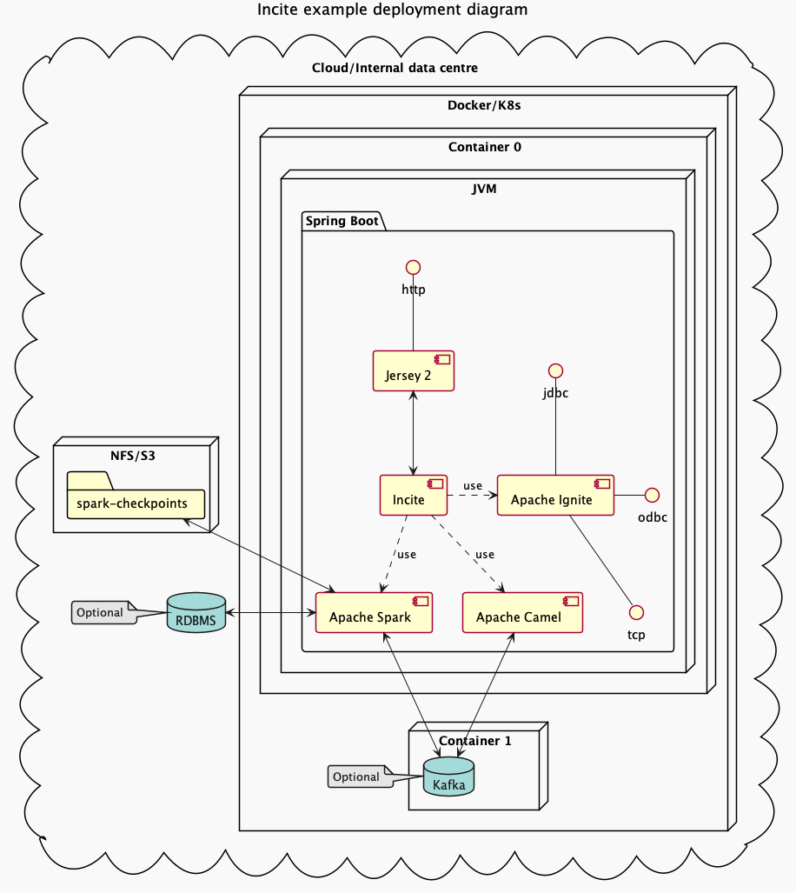

# Incite distribution

## Building

### Prerequisite
* Git (for checking out the latest development/release build)
* Java SDK 8+
* Maven 3.6+ (May be embedded in your IDE)

### Nice to have
* Your preferred IDE (Eclipse/IntelliJ/VS Code)

## Deployment
Incite can be run in the following ways,

* via Docker
* via Kubernetes (K8s)
* via Shell

